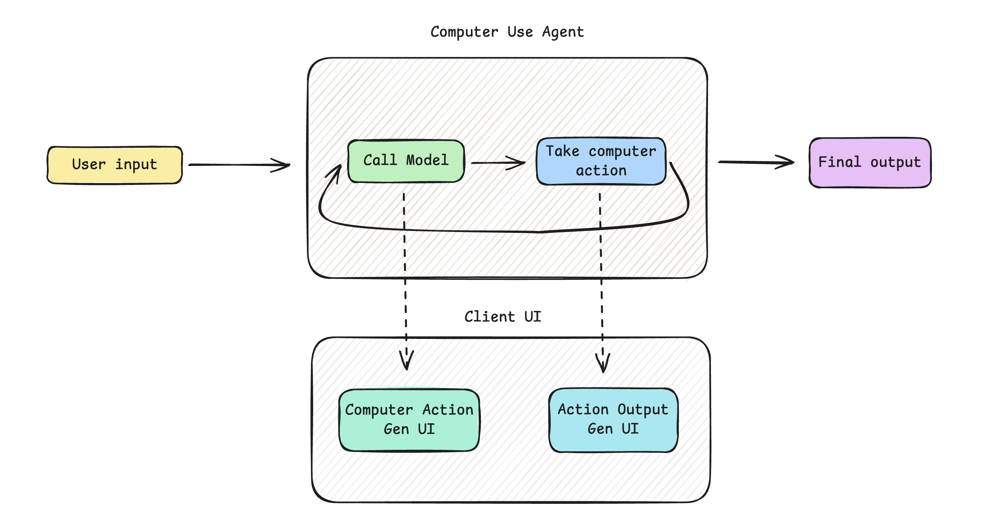

# Computer Use Agent Generative UI

A Generative UI web app for interacting with Computer Use Agents (CUA) via the `@langchain/langgraph-cua` prebuilt package.



## Quickstart

The following API keys are required to run this app:

- [OpenAI API Key](https://platform.openai.com/) - Calling the computer use model
- [Scrapybara API Key](https://scrapybara.com/) - Running the VM

Once you have both API keys, you can clone the repo:

```bash
git clone https://github.com/bracesproul/gen-ui-computer-use.git
```

Navigate to the project directory:

```bash
cd gen-ui-computer-use
```

Copy the `.env.example` file to `.env` and add your API keys:

```bash
cp .env.example .env
```

Add your OpenAI API key and Scrapybara API key to the `.env` file:

```bash
OPENAI_API_KEY=your_openai_api_key
SCrapybara_API_KEY=your_scrapybara_api_key
```

Install dependencies:

```bash
pnpm install
```

Run both the agent and the app:

```bash
# Run the web server
pnpm run dev
```

In another terminal window:

```bash
# Run the agent
pnpm run agent
```

The app will be available at `http://localhost:3000`.

## License

[MIT](./LICENSE)
